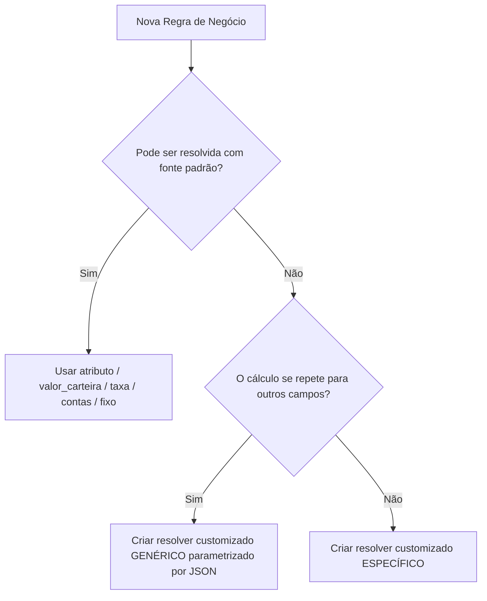

# 💡 Diretrizes de Clean Code & DRY para Mapeamentos (AI/Developer Skill)

Este documento atua como um **guia arquitetural permanente** (Skill) para desenvolvedores e agentes de IA. Ele descreve as melhores práticas de **Clean Code** e **DRY (Don't Repeat Yourself)** ao criar novos mapeamentos e resolvers customizados no Sistema de Carteiras Carmel Capital.

---

## 🚀 Princípios Fundamentais

Antes de escrever qualquer código Python customizado em `ConfigDrivenBuilder`, siga a seguinte árvore de decisão:



---

## 🛠️ Técnica 1: Resolvers Parametrizados (DRY)

**Evite a todo custo** criar múltiplas funções semelhantes que variam apenas em strings fixas ou parâmetros de busca.
Em vez disso, aproveite o fato de o `MappingEngine` passar o objeto `item` (a regra definida no JSON) para a assinatura da sua função customizada.

### Exemplo Incorreto (Violando DRY):
```python
# 🚫 RUIM: Código repetitivo e difícil de manter
def resolver_cota_senior_1(c, _):
    return float(c.df_senior.loc[c.df_senior["CATEGORIA"] == "Senior 1", "PU Mercado"].values[0])

def resolver_cota_senior_2(c, _):
    return float(c.df_senior.loc[c.df_senior["CATEGORIA"] == "Senior 2", "PU Mercado"].values[0])
```

### Exemplo Correto (Clean & DRY):
```python
#  BOM: Uma única função parametrizada pelo campo "filtro" ou "chave_etl"
def resolver_cobuccio_senior(c, item):
    try:
        return float(c.df_senior.loc[c.df_senior["CATEGORIA"] == item.filtro, "PU Mercado"].values[0])
    except Exception:
        return 0.0
```

#### Configuração JSON correspondente:
```json
{
  "categoria": "COTA SENIOR 1",
  "fonte": "custom",
  "nome_funcao": "resolver_cobuccio_senior",
  "filtro": "Senior 1"
},
{
  "categoria": "COTA SENIOR 3",
  "fonte": "custom",
  "nome_funcao": "resolver_cobuccio_senior",
  "filtro": "Senior 3"
}
```

---

## 📈 Técnica 2: Soma Declarativa no MappingEngine

O `MappingEngine` do sistema acumula e soma automaticamente valores definidos sob a **mesma categoria** no arquivo JSON.
Use esse comportamento nativo para evitar escrever fórmulas de adição (`+`) diretamente em Python.

### Exemplo Incorreto (Violando DRY):
```python
# 🚫 RUIM: Operação matemática hardcoded em Python
def resolver_cobuccio_over(c, _):
    return c.somar_coluna_dataframe('ltno', 'Valor Líquido') + \
           c.somar_coluna_dataframe('ntn o', 'Valor Líquido') + \
           c.somar_coluna_dataframe('lfto', 'Valor Líquido')
```

### Exemplo Correto (Declarativo):
1. Crie uma única função genérica de soma de seção parametrizada por `chave_etl`:
```python
#  BOM: Função reutilizável para somar QUALQUER seção da planilha
def resolver_cobuccio_soma_secao(c, item):
    return c.somar_coluna_dataframe(item.chave_etl, 'Valor Líquido')
```

2. Defina as parcelas diretamente no arquivo JSON sob a mesma `"categoria"`:
```json
{
  "categoria": "Over/Compromissada",
  "fonte": "custom",
  "nome_funcao": "resolver_cobuccio_soma_secao",
  "chave_etl": "ltno"
},
{
  "categoria": "Over/Compromissada",
  "fonte": "custom",
  "nome_funcao": "resolver_cobuccio_soma_secao",
  "chave_etl": "ntn o"
},
{
  "categoria": "Over/Compromissada",
  "fonte": "custom",
  "nome_funcao": "resolver_cobuccio_soma_secao",
  "chave_etl": "lfto"
}
```

---

## 📌 Checklist para Desenvolvimento de Mapeamentos

- [ ] **Utilize fontes built-in:** Sempre use `atributo`, `taxa`, `valor_carteira` ou `contas` antes de apelar para `custom`.
- [ ] **Evite repetição de nomes de funções:** Se o nome da função termina com `_1`, `_2`, `_3` ou se difere por uma string de chave, ela **deve** ser fundida em uma única função genérica parametrizada por `filtro` ou `chave_etl`.
- [ ] **Aproveite a acumulação nativa:** Se precisar somar campos de fontes diferentes ou seções diferentes para uma mesma categoria, simplesmente liste-os como múltiplos objetos com a mesma `"categoria"` no JSON.
- [ ] **Inversão de sinal robusta:** Se precisar negativar uma despesa ou passivo, não crie uma função customizada multiplicando por `-1`; use a propriedade nativa `"multiplicador": -1.0` no JSON.
- [ ] **Tratamento de exceções:** Todo custom resolver genérico deve ser protegido com blocos `try/except` robustos que retornam `0.0` em caso de dados corrompidos ou ausentes no Excel, evitando travar a execução inteira do relatório.
