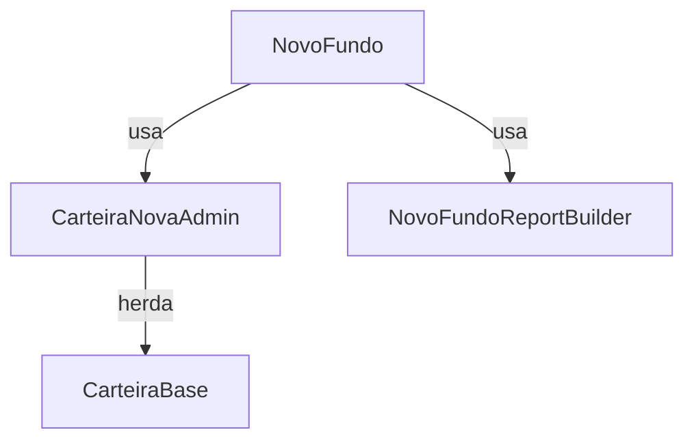
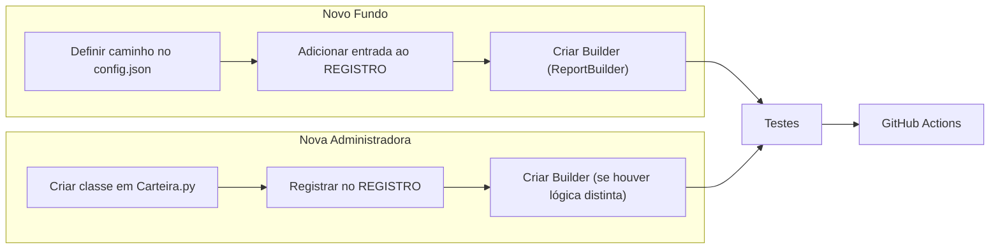

# Fluxo Completo para Criação de Novas Administradoras e Novos Fundos

## Visão Geral
Este documento descreve passo‑a‑passo **tudo que você precisa fazer** para adicionar:
1. **Uma nova administradora** (classe de carteira) ao código base.
2. **Um novo fundo** (registro) que usa uma administradora já existente ou a que acabou de ser criada.

Ele cobre:
- Estrutura de diretórios e arquivos relevantes.
- Alterações de código (classes, builders, registro, configurações).
- Atualização de arquivos de configuração (`config.json` e `.env`).
- Criação/atualização de testes unitários e de integração.
- Validação automática via CI (GitHub Actions).
- Boas práticas de manutenção e versionamento.

---

## 1. Preparação do Ambiente
```bash
# Certifique‑se de estar com o venv ativo
source venv/Scripts/activate   # Windows PowerShell
# Atualizar dependências (caso tenha alterado requirements.txt)
pip install -r requirements.txt
```
> **Obs.** O projeto já usa `pydantic`, `python‑dotenv`, `pytest` e `pytest‑cov`.

---

## 2. Adicionar uma Nova Administradora (Classe de Carteira)
### 2.1. Criar a classe em `Carteira.py`
1. Abra `Carteira.py` (local: `c:/.../CARTEIRA/Carteira.py`).
2. Replicar a estrutura de uma classe existente (ex.: `CarteiraBRL`).
```python
class CarteiraNovaAdmin(CarteiraBase):
    """Leitor de planilhas da administradora *NovaAdmin*.
    Herda de `CarteiraBase` que fornece utilities comuns.
    """

    def __init__(self, caminho_carteira: str):
        super().__init__(caminho_carteira)
        # atributos específicos da nova admin (ex.: nomes de colunas)
        self.coluna_data = "Data"
        self.coluna_valor = "Valor"

    def _processar_cabecalho(self) -> None:
        # Implementar leitura/transformação do cabeçalho conforme o layout da admin
        df = self._ler_aba("Resumo")
        # ... limpeza e normalização
        self.dataframe_1 = df

    def _processar_detalhe(self) -> None:
        # Implementar leitura das linhas de detalhe (contas a pagar, cotas, etc.)
        df = self._ler_aba("Detalhe")
        # ... lógica de agrupamento
        self.df_detalhe = df
```
3. **Não** esquecer de importar a classe no topo do arquivo (logo após os demais imports).
```python
from Carteira import CarteiraNovaAdmin
```
4. (Opcional) Atualizar a docstring da hierarquia no início do arquivo para incluir a nova classe.

### 2.2. Registrar a classe no `registry.py`
```python
"NOVO_ADMIN_FUNDO": ConfiguracaoFundo(
    nome="Nome Completo do Fundo",
    chave_carteira="NOVO_ADMIN_FUNDO",
    chave_gerencial="NOVO_ADMIN_FUNDO",
    classe_carteira=CarteiraNovaAdmin,   # <‑‑ aqui
    builder=NovoAdminReportBuilder,       # Builder será criado no próximo passo
)
```
> **Importante:** o import da classe deve estar presente no início de `registry.py`:
```python
from Carteira import CarteiraNovaAdmin
```

---

## 3. Criar o Builder de Relatório (Mapeamento CD/MEC)
### 3.1. Arquivo `src/services/report_builder.py`
1. Copie um builder existente (ex.: `FidaraReportBuilder`).
2. Renomeie para `NovoAdminReportBuilder` e ajuste os campos que variam.
```python
class NovoAdminReportBuilder(ReportBuilderBase):
    """Mapeia os campos da *NovaAdmin* para o Excel gerencial.
    Cada método devolve uma lista de dicionários que será transformada
    em DataFrames pelo `ExcelWriter`.
    """

    def construir_mapeamento_cd(self, carteira: CarteiraBase) -> list[dict]:
        # Exemplo simplificado – ajuste conforme a sua estrutura de dados
        return [
            {"Categoria": "Patrimônio", "Valor": carteira.patrimonio_total},
            {"Categoria": "Cotas", "Quantidade": carteira.qtd_cotas, "PU": carteira.pu_media},
            # … outros mapeamentos específicos da admin …
        ]

    def construir_mapeamento_mec(self, carteira: CarteiraBase) -> list[dict]:
        # Mapeamento de contas a pagar / despesas
        return [
            {"Categoria": conta, "Valor": carteira.contas_pagar.get(conta, 0.0)}
            for conta in carteira.lista_contas_pagar
        ]
```
3. Adicione o import no início do arquivo:
```python
from src.services.report_builder import NovoAdminReportBuilder
```

---

## 4. Configurar o Novo Fundo (ou Administradora) em `config.json`
### 4.1. Se a administradora já existe (ex.: `CarteiraBRL`) – **novo fundo**
```json
"carteiras": {
    "NOVO_FUNDO": "01 - OPERACIONAL/CONTROLADORIA/01 - Relatorios Diarios/Carteira Diaria/.../NovoFundo.xlsx"
},
"arquivo_gerencial": {
    "NOVO_FUNDO": "NOVO_FUNDO_GERENCIAL.xlsb"
},
"configuracoes_fundos": {
    "NOVO_FUNDO": { "contas_pagar": ["Administração", "Auditoria", "Gestão"] }
}
```
### 4.2. Se a administradora é nova – **adicionar ao `config.json`**
O `config.json` não armazena a estrutura da classe, apenas caminhos. Basta garantir que a chave `carteiras` e `arquivo_gerencial` existam conforme o formato acima.

---

## 5. Atualizar o Registro (`src/registry.py`)
Já descrito no passo 2.2. **Resumo rápido**:
```python
"NOVO_FUNDO": ConfiguracaoFundo(
    nome="Nome Oficial",
    chave_carteira="NOVO_FUNDO",
    chave_gerencial="NOVO_FUNDO",
    classe_carteira=CarteiraBRL,           # ou CarteiraNovaAdmin
    builder=NovoFundoReportBuilder,
    abrir_apos_salvar=True,                # opcional
    chave_fundo_efetiva="NOVO_FUNDO",    # usado para contas a pagar
)
```
> Não esquecer de **importar** `NovoFundoReportBuilder` e a classe de carteira no topo do arquivo.

---

## 6. Testes
### 6.1. Teste Unitário do Builder
Crie/edite `tests/services/test_report_builder.py`:
```python
class TestNovoFundoReportBuilder:
    def setup_method(self):
        self.builder = NovoFundoReportBuilder()
        self.mock_carteira = MockCarteira()
        # preencha atributos relevantes (patrimonio_total, qtd_cotas, …)
        self.mock_carteira.patrimonio_total = 1_000_000.0
        self.mock_carteira.qtd_cotas = 10_000
        self.mock_carteira.pu_media = 100.0
        self.mock_carteira.lista_contas_pagar = ["Administração", "Auditoria"]
        self.mock_carteira.contas_pagar = {"Administração": 5000, "Auditoria": 2000}

    def test_mapeamento_cd(self):
        cd = self.builder.construir_mapeamento_cd(self.mock_carteira)
        assert any(r["Categoria"] == "Patrimônio" and r["Valor"] == 1_000_000 for r in cd)

    def test_mapeamento_mec(self):
        mec = self.builder.construir_mapeamento_mec(self.mock_carteira)
        assert {"Categoria": "Administração", "Valor": 5000} in mec
```
### 6.2. Teste de Integração (pipeline)
No `tests/integration/test_pipeline.py` adicione um caso usando o novo fundo.
```python
def test_pipeline_novo_fundo():
    result = processar_fundo_registrado("NOVO_FUNDO")
    assert result is None  # a função não devolve nada, apenas não lança exceções
```
> Rode todos os testes localmente:
```bash
pytest -q
```
Todos devem passar (`0 failures`).

---

## 7. CI / GitHub Actions
O workflow já existente (`.github/workflows/python-tests.yml`) executa:
- Instalação das dependências.
- Execução de `pytest --cov=src`.
- Upload de coverage (opcional).
> **Não é necessário mudar o workflow** para novos fundos, ele já cobre todo o diretório `src` e `tests`.

---

## 8. Atualização de Documentação
1. Atualize `README.md` ou `DOCUMENTACAO_TESTES.md` para incluir o nome do novo fundo/administradora.
2. No `TODO.md` marque a tarefa como concluída.
3. (Opcional) Gere um diagrama Mermaid que mostre a nova dependência:

4. Commit e push – o CI verificará tudo.

---

## 9. Checklist de Deploy
- [ ] Classe de carteira criada e importada.
- [ ] Builder criado e importado.
- [ ] `config.json` atualizado (caminhos e contas a pagar).
- [ ] Registro (`REGISTRO`) atualizado.
- [ ] Testes unitários e de integração adicionados.
- [ ] `pytest` local roda com 100 % de sucesso.
- [ ] `git push` → CI passa.
- [ ] Documentação (README, DOCS, TODO) atualizada.

---

## 10. Resumo Visual (Fluxo Simplificado)


---

### 🎉 Pronto!
Com esses passos você pode **expandir o ecossistema** de carteiras sem tocar em código legado, mantendo a arquitetura *Open/Closed* e a cobertura total de testes.

---

*Documento gerado automaticamente por Antigravity – seu assistente de codificação.*
